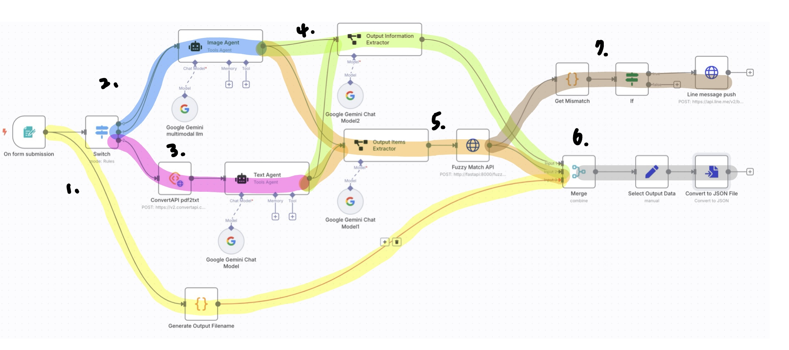

# Invoice Agent Workflow Description

## Overview
- 使用者將訂單的檔案提交之後，透過不同的google llm 模型解析客戶名稱、訂購日期、商品內容等資訊，再將商品內容送到模糊比對的api，最後生成一個json檔案
## Instructions
- 按下 Test Workflow按鈕，系統會自動跳出表單
- 選擇檔案後按下Submit
- 流程執行結束之後即可在最後一個節點(`Convert to JSON File`) 的output中下載檔案

## Components
- Trigger: 節點`On form submission`
    - 供使用者提交的表單，可支援.jpg,.jpeg,.png,.pdf

- Branches
    1. （黃色）將輸入檔案名稱轉換為最後輸出的json檔名
        - 節點`Generate Output Filename`: 例如輸入為`abc.jpg` 輸出將會是 `{output_filename: abc.json}` 

    2. (藍色）如果檔案為影像（.jpg,.jpeg,.png）則直接用Gemini解析
        - 節點`AI Agent`: prompt 如下
            ```
            所提供的圖片是一份訂單資料 
            請解析圖片中的訂購日期客戶名稱 商品編號 名稱與數量
            如果沒有對應資訊 請回傳無
            回答時請使用繁體中文
            ```
    3. （桃紅）如果檔案為.pdf，則先轉成.txt再用Gemini解析
        - 節點`ConvertAPI pdf2txt`: 使用api  https://v2.convertapi.com/convert/pdf/to/txt
        - 節點`BasicLLM`: prompt 如下
            ```
            所提供的文字是一份訂單資料
            請解析文字中的訂購日期 客戶名稱 商品編號 名稱與數量
            若無對應的資訊 請回傳無
            回答時請使用繁體中文
            ```
        - 節點`Change Key Name` : 修改output key 為了使節點`BasicLLM`和節點`AI Agent`一致
    4. （綠色）從2.,3. 的模型輸出中，用Gemini萃取出訂購日期（`order_date`）和客戶名稱（`customer_name`）並轉換成json格式
        - 節點`Output Information Extractor`: system prompt 如下
            ```
            You are an expert extraction algorithm.
            Only extract relevant information from the text.
            Please replace "無" with "blank"
            ```
            JSON Example 如下
            ```
            {
	        "order_date": "2025-03-01",
	        "customer_name": "hello world"
            }
            ```
    5. （綠色）從2.,3. 的模型輸出中，用Gemini萃取出商品資訊(`items`)並轉換成json格式，再post至執行fuzzy match的api，從`客戶訂單資料.xlsx`中找到最相似的商品，並附上match score
        - 節點`Output Items Extractor`: JSON Example 如下
        ```
        {
          "items": [
            {
              "product_id": "J001010",
              "product_name": "東坡肉",
              "amount": 42,
              "unit": "塊"
            },
            {
              "product_id": "F001100",
              "product_name": "金針菇",
              "amount": 3,
              "unit": "把"
            }
          ]
        }
        ```
        - 節點`Fuzzy Match API`: 連接一個fastapi server，由另一個container提供。fuzzy match 演算法詳請見`app/api.py`
- 節點`Merge`: 將1.,4.,5.的輸出結合再一起
- 節點`Select Ouput Data`: 挑選出要寫入最終json檔的欄位（`order_date`, `customer_name`, `items`, `output_filename`）
- 節點`Convert to JSON File`: 輸出成.json檔，可供下載
